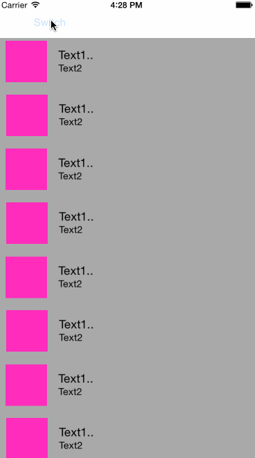

# Continuity using UICollectionView 
Grid to list, list to grid.



## How To Use
Remember to set AutoLayout correctly.
```objc
	//CollectionView to animate Cell
    [_theCollectionView performBatchUpdates:^{
        for (CollectionViewCell *cell in [_theCollectionView visibleCells]) {
            [cell updateLayout]; //Cell to animate there own subviews
        }
    } completion:^(BOOL finished) {}];

```

## License
UICollectionView_Continuity is available under the MIT license. See the LICENSE file for more info.